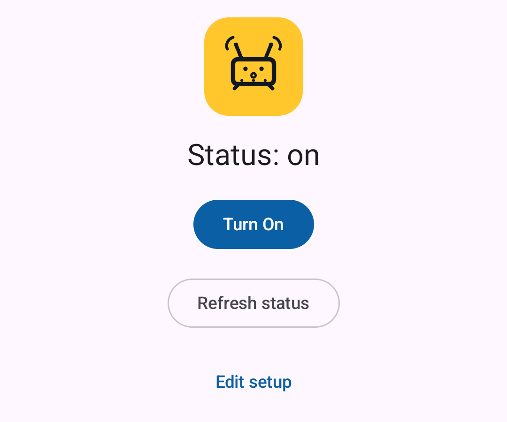

# RouterWake

**Requires a FritzBox** — this only works if your home router is one.
Sends Wake-on-LAN to a home PC through it and shows whether it's on.
Talks to the FritzBox over **TR-064** (SOAP/UPnP), not the web portal
login — no port forwarding, no relay device. You get the phone onto the
FritzBox's LAN yourself (VPN or otherwise) before using it; the app
doesn't manage that connectivity itself.

The FritzBox web UI can already do this, but it's buried behind several
clicks (log in → Home Network → find the device → wake it). This turns
that into one button, once set up.



## FritzBox-side setup

The app's first-run onboarding covers this, but for reference:

- Enable TR-064: FritzBox web UI → *Home Network → Network → Network
  Settings* → "Allow access for applications" (reboots the FritzBox).
- Create a **dedicated FritzBox user** (Home Network → FRITZ!Box Users)
  with "FRITZ!Box Settings" access — the granular checkboxes don't map
  cleanly onto TR-064's Hosts service.
- TR-064 should only be reachable from LAN/VPN, never WAN.
- Note the PC's MAC address and LAN IP.

## Running it

No config file — host/port/credentials/MAC/IP are entered in-app on
first launch and stored Keystore-encrypted on-device.

1. Run on a real device (the emulator can't reach the FritzBox's LAN, so
   TR-064 calls will just fail to connect — UI iteration only).
2. Get the phone onto the FritzBox's network before opening the app.
3. First launch: onboarding wizard → details form (`fritz.box` is the
   default host). Reachable again via "Edit setup".
4. Grant local network access (Android 17+ requires it separately from
   internet access).
5. "Turn On" wakes the PC. Status auto-polls every 5s — mascot plate is
   yellow (on) / blue (off/unknown) / red (check failed). "Refresh
   status" forces an immediate check.

## Project layout

```
app/src/main/java/com/jakspinning/wakemypc/
  MainActivity.kt          Compose UI: status mascot, "Turn On"/refresh buttons
  OnboardingScreen.kt      First-run tutorial + the FritzBox/PC details form
  SettingsRepository.kt    Reads/writes config, encrypted via Android Keystore
  Theme.kt                 App-wide blue color scheme
  RouterMascotIndicator.kt Live status indicator (reuses the launcher icon's artwork)
  network/
    DigestAuthenticator.kt Hand-rolled OkHttp Digest Auth (MD5, RFC 2617)
    SoapEnvelope.kt         Builds the small TR-064 SOAP XML
    FritzTr064Client.kt     wakeOnLan(), over TR-064
    HostReachability.kt     pingHost() — the "is it on" check (see below)
```

Status is checked by pinging the PC's LAN IP directly rather than asking
the FritzBox. TR-064's host table only reports whether a MAC address has
link, and a PC with "Wake on Magic Packet" enabled (required for WOL to
work at all) keeps its Ethernet PHY powered while fully shut down — so
the FritzBox reports it as permanently connected, even off. A direct
ping reflects whether the OS network stack is actually up.

This assumes the PC responds to ICMP pings on the LAN, which Windows
usually does for a network set to "Private" with network
discovery/file-sharing on (the common default for a home PC). If status
always reads "off" even when the PC is on, check Windows Firewall →
Advanced settings → Inbound Rules → "File and Printer Sharing (Echo
Request - ICMPv4-In)" is enabled for the Private profile.

## Privacy

Everything entered is encrypted at rest with an Android Keystore-backed
key (`SettingsRepository.kt`) — never leaves the device. `INTERNET`
permission exists only because OkHttp needs it to make an HTTP request at
all; the only host contacted is the FritzBox address entered. No
analytics, no accounts, no server this project runs.

## Not in scope yet

- In-app WireGuard VPN connect/disconnect.
- SSH-based remote shutdown.
- Biometric prompt gating the buttons.
- TLS to the FritzBox (port 49443, self-signed cert).
